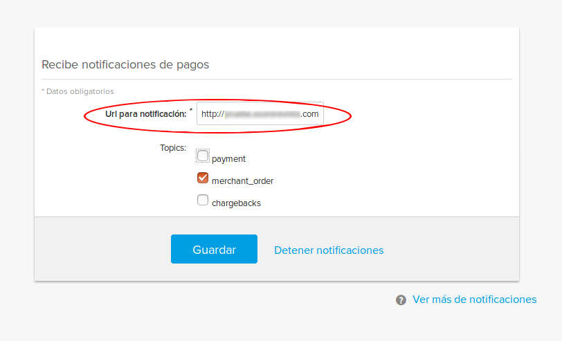

# Pasarela de Pago de Mercado Pago para Membership Pro (Mercado Pago payment plugin for Membership Pro).

Este plugin de [Joomla](https://www.joomla.org/) es una simple pasarela de pagos de [MercadoPago](https://www.mercadopago.com.ar/) para el componente denominado [Membership Pro](https://extensions.joomla.org/extension/membership-pro/).

Para poder usarlo en su sitio web necesitará una cuenta en [MercadoPago](https://www.mercadopago.com.ar/) desde la cuál podrá obtener las credenciales necesarias para configurar el plugin.

---

# Licencia

Para conocer la licencia de uso, lea el archivo LICENSE.

---

## Instalación del plugin

1.    Descargue el archivo .zip que se encuentra en el directorio dist.

2.    Ingrese al backend de Joomla como administrador.

3.    Click en el menú Componentes -> Membership Pro -> Payments Plugins

4.    Seleccione el archivo a instalar y oprima instalar

---

## Configuración del plugin

Una vez que el plugin ha sido instalado, haga clic en el enlace correspondiente a MercadoPago para completar la configuración del plugin.

Los token tienen que ser obtenidos desde sus credenciales de MercadoPago en <https://www.mercadopago.com/mla/account/credentials>

---

## Configuración del **IPN** (**I**nstant **P**ayment **N**otification)

Primero debe configurar la URL IPN en MercadoPago en:

<https://www.mercadopago.com.ar/ipn-notifications>

Esta URL IPN debería ser:

https://**YOUR-IPN-DOMAIN-NAME**/index.php?option=com_osmembership&task=payment_confirm&payment_method=dls_mercadopago

Donde **YOUR-IPN-DOMAIN-NAME** es el nombre del dominio de sus sitio web, en cual está esperando recibir las notificaciones IPN desde MercadoPago.

---

## CSS personalizado

Si lo desea, puede incluir sus propios archivos .css.

Estos archivos serán cargados cuando se puestre la págia de redireccionamiento.

Para incluir su propio archivo de estilos siga el siguiente procedimiento:

1.  Cree un directorio llamado **dls_mercadopago/css** en el directorio de Joomla llamado **media** (/media).
2.  Copie su archivo css en ese directorio.
3.  Cuando la página de redirección sea cargada en el navegador incluirá los archivos .css desde es directorio mencionado.

---

## Javascript personalizado

De forma similar a los archivos .css mencionados arriba, también puede incluir su propio código javascript.

1.  Cree un directorio llamado **dls_mercadopago/js** en el directorio **media** de Joomla (/media).
2.  Copie sus archivos de javascript (.js) en este directorio.
3.  Al cargarse la página de redirección, el navegador incluirá sus archivos .js desde el directorio mencionado.

## Personalización de la página de redirección

Es posible personalizar la página de redirección usada por el plugin reemplazando la distribución por defecto provista con el plugin.

1.  Cree una carpeta **dls_mercadopago/layouts** en el directorio **media** de Joomla (/media).
2.  Copie su nueva pagina de redireccionamiento a este directorio, usando el nombre **dls_mercadopago.php**.
3.  Cuando la página de redireccionamiento sea mostrada el plugin utilizará su archivo personalizado en vez del que es provisto por defecto con el plugin.

---

## Depuración

El plugin cuenta con configuraciones de depuración que permiten registrar información en un archivo de registro (log).

A este archivo lo encontrá en la carpeta que tenga configurada en su Joomla como directorio de log.

---

## Estructura de directorios de este repositorio.

-    **src**: código fuente PHP de la pasarela de pago.

-    **dist**: extensión de Joomla lista para ser instalada en formato .zip.

-    **docs**: documentación de la extensión

-    **buildtool**: si usted es programador PHP, puede encontrar en este directorio un simple script de gulp para construir el archivo de distribución después de que haga modificaciones en el código fuente PHP. Para poder ejecutar este script necesitará [node.js](https://nodejs.org/). Dentro de esta carpeta también encontrará el archivo [README.md](buildtool/README.md) con una breve descripción de cómo usar el script.

---

## Referencias para programadores PHP:

* MercadoPago: https://www.mercadopago.com.ar/developers/es/guides/payments/web-payment-checkout/introduction/

* Membership Pro: http://membershipprodoc.joomservices.com/developer-documentation/dev-payment-plugin

* IPN: https://groups.google.com/forum/#!topic/mercadopago-developers/yaThxsMsHKo

